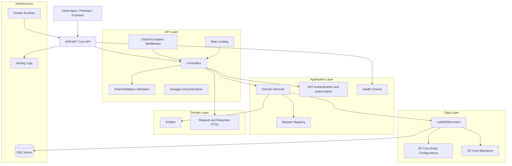
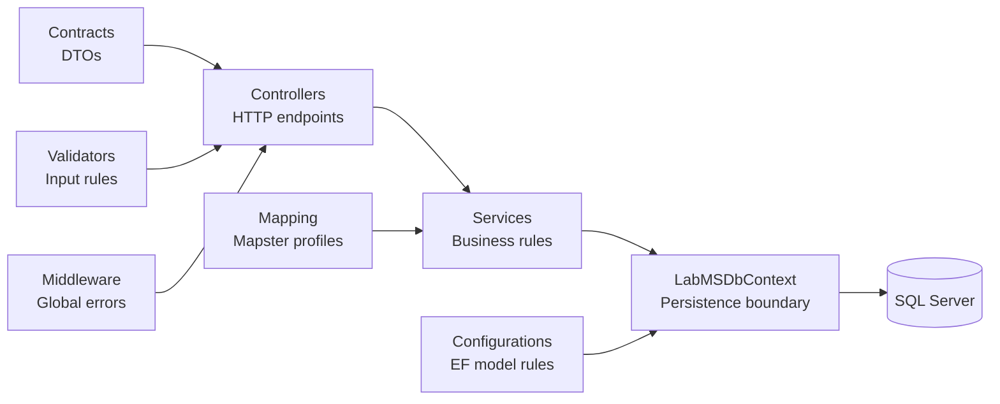
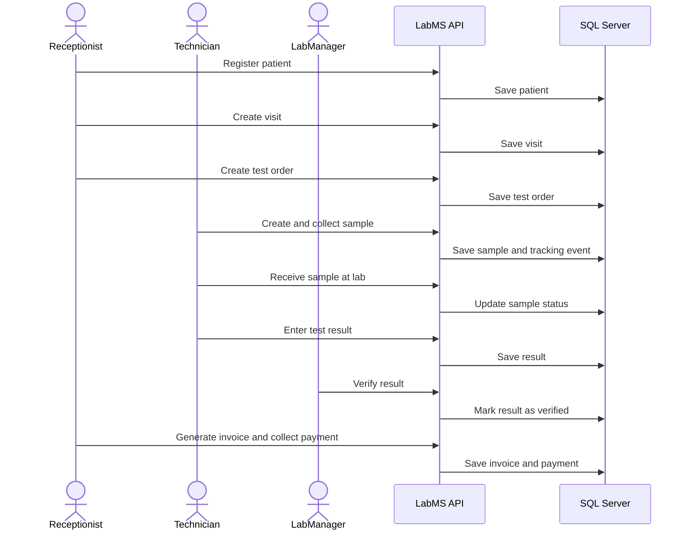
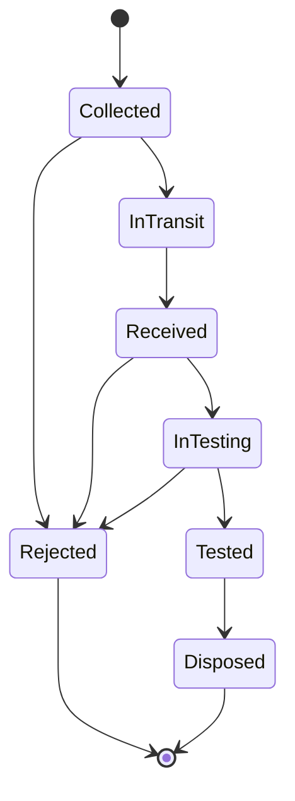
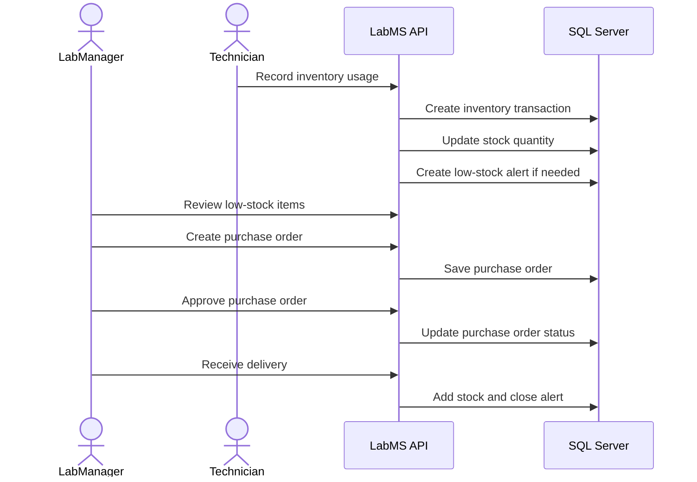
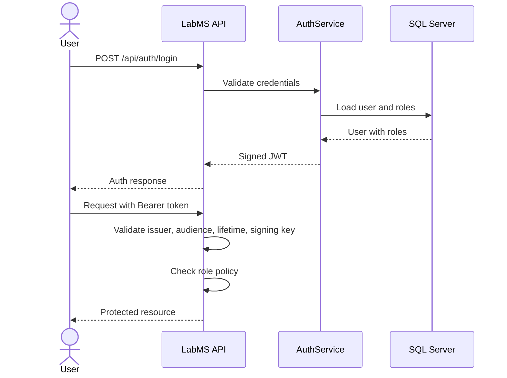
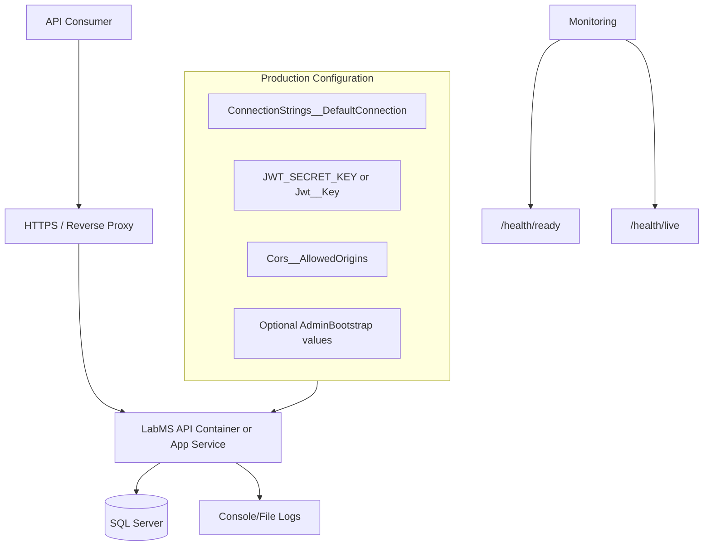

# LabMS - Laboratory Management System API

LabMS is a production-hardened ASP.NET Core 8 Web API for managing the operational workflow of a medical laboratory. It covers patient registration, doctor referrals, visits, lab test ordering, sample tracking, result verification, reporting, billing, inventory, suppliers, purchase orders, insurance claims, refunds, discounts, taxes, package subscriptions, users, roles, and analytics.

The project is designed as a portfolio-ready backend system that demonstrates layered architecture, domain modeling, role-based security, EF Core persistence, validation, logging, rate limiting, health checks, Docker support, and automated tests.

## Project Highlights

- Built with .NET 8, ASP.NET Core Web API, SQL Server, and EF Core.
- Layered architecture with Controllers, Services, Contracts, Entities, Validators, EF Configurations, and Middleware.
- JWT authentication with BCrypt password hashing.
- Role-based authorization for Admin, LabManager, Receptionist, and Technician.
- FluentValidation request validation.
- Mapster object mapping.
- Serilog structured logging to console and files.
- Production startup checks for JWT secret and database connection.
- Database readiness and liveness health endpoints.
- Rate limiting for authentication and general API traffic.
- Optional first-admin bootstrap through configuration.
- Dockerfile included for containerized deployment.
- EF Core migrations included for database versioning.
- Postman collections included for API testing.

## Tech Stack

| Area | Technology |
| --- | --- |
| Backend | ASP.NET Core 8 Web API |
| Language | C# |
| Database | SQL Server |
| ORM | Entity Framework Core 8 |
| Authentication | JWT Bearer |
| Password Security | BCrypt.Net |
| Validation | FluentValidation |
| Mapping | Mapster |
| Logging | Serilog |
| API Docs | Swagger / Swashbuckle |
| Testing | xUnit, FluentAssertions, EF Core InMemory |
| Deployment | Docker |

## Business Modules

| Module | Purpose |
| --- | --- |
| Authentication and Roles | Login, registration, JWT issuing, role assignment, protected endpoints |
| Patients | Patient demographic data and registration |
| Doctors | Referring doctor management |
| Visits | Patient encounters and lab visit workflow |
| Lab Tests | Test catalog, pricing, and test metadata |
| Test Orders | Ordered tests linked to patients and visits |
| Samples | Barcode-style sample creation, receiving, testing, and tracking |
| Test Results | Result entry and verification |
| Reports | Generated lab reports |
| Invoices and Payments | Billing, payment recording, and invoice lifecycle |
| Insurance Claims | Claim submission and tracking |
| Payment Plans | Installment payment workflows |
| Discounts and Taxes | Billing rules and tax configuration |
| Refunds | Refund request and processing workflow |
| Test Packages | Bundled test packages and subscriptions |
| Inventory | Stock items, transactions, alerts, and expiry tracking |
| Suppliers and Purchase Orders | Procurement and supplier workflow |
| Analytics | Operational and business metrics |

## Architecture Diagram



## Layered Structure



## Core Workflow: Patient Visit to Result



## Sample Tracking Workflow



## Inventory and Procurement Workflow



## Authentication and Authorization Flow



## Deployment View



## API Surface

The API follows REST-style controller routes under `/api/[controller]`.

Important controllers include:

- `/api/auth`
- `/api/patients`
- `/api/doctors`
- `/api/visits`
- `/api/labtests`
- `/api/testorders`
- `/api/samples`
- `/api/testresults`
- `/api/reports`
- `/api/invoices`
- `/api/payments`
- `/api/insuranceclaims`
- `/api/paymentplans`
- `/api/refunds`
- `/api/discounts`
- `/api/taxes`
- `/api/testpackages`
- `/api/packagesubscriptions`
- `/api/inventory`
- `/api/suppliers`
- `/api/purchaseorders`
- `/api/analytics`
- `/api/users`
- `/api/roles`

Swagger is enabled in Development mode.

## Production Readiness

This project includes several production-oriented safeguards:

- Startup fails if the JWT signing key is missing or shorter than 32 characters.
- Startup fails if the database connection string is missing or still contains placeholder values.
- JWT validation checks issuer, audience, lifetime, and signing key.
- CORS origins are configuration-driven.
- Global exception handling returns structured JSON errors.
- Health endpoints separate readiness and liveness:
  - `/health/ready` checks database connectivity.
  - `/health/live` checks application liveness.
- Rate limiting protects authentication and API traffic.
- Production configuration avoids hardcoded credentials.
- Optional admin bootstrap avoids hardcoded admin accounts.

## Required Production Configuration

Set these values in your hosting environment:

```bash
ConnectionStrings__DefaultConnection="Server=YOUR_SERVER;Database=LabMS_Production;User Id=YOUR_USER;Password=YOUR_PASSWORD;TrustServerCertificate=True"
JWT_SECRET_KEY="your-strong-32-character-minimum-secret"
ASPNETCORE_ENVIRONMENT="Production"
Cors__AllowedOrigins__0="https://your-frontend-domain.com"
```

Optional first-admin bootstrap:

```bash
AdminBootstrap__Enabled="true"
AdminBootstrap__Username="admin"
AdminBootstrap__FullName="System Administrator"
AdminBootstrap__Email="admin@example.com"
AdminBootstrap__Password="StrongPassword123!"
```

After the first admin user is created, disable admin bootstrap.

## Getting Started

### 1. Restore packages

```bash
dotnet restore
```

### 2. Build

```bash
dotnet build LabMS.sln
```

### 3. Apply migrations

```bash
dotnet ef database update
```

### 4. Run

```bash
dotnet run --project LabMS.csproj
```

### 5. Open Swagger in Development

```text
https://localhost:5001/swagger
```

## Tests

Run the test suite:

```bash
dotnet test LabMS.sln
```

The current tests include JWT configuration coverage to verify that tokens generated with environment-style secrets are valid and weak signing keys are rejected.

## Docker

Build the image:

```bash
docker build -t labms-api .
```

Run the container with production configuration:

```bash
docker run -p 8080:8080 ^
  -e ASPNETCORE_ENVIRONMENT=Production ^
  -e JWT_SECRET_KEY=your-strong-32-character-minimum-secret ^
  -e ConnectionStrings__DefaultConnection="Server=YOUR_SERVER;Database=LabMS_Production;User Id=YOUR_USER;Password=YOUR_PASSWORD;TrustServerCertificate=True" ^
  labms-api
```

## Resume Summary

Suggested CV bullet:

> Built a production-hardened Laboratory Management System REST API using ASP.NET Core 8, SQL Server, EF Core, JWT authentication, role-based authorization, FluentValidation, Serilog, Docker, health checks, and layered service architecture to manage patients, lab orders, sample tracking, test results, billing, inventory, procurement, and analytics.

## Repository Structure

```text
LabMS/
├── Controllers/        API endpoints
├── Services/           Business logic and interfaces
├── Entities/           Domain/database entities
├── Contracts/          Request and response DTOs
├── Validators/         FluentValidation validators
├── Configurations/     EF Core entity configurations
├── Data/               LabMSDbContext
├── Middleware/         Global exception handling
├── Mapping/            Mapster mapping configuration
├── Migrations/         EF Core migrations
├── Postman/            Postman collections and environment
├── LabMS.Tests.New/    Automated tests
└── Dockerfile          Container build definition
```

## Status

The project builds and tests successfully and is suitable as a strong backend portfolio project. Before real clinical use, it should still go through a full production deployment review, security review, load testing, privacy/compliance review, and broader workflow integration testing.
