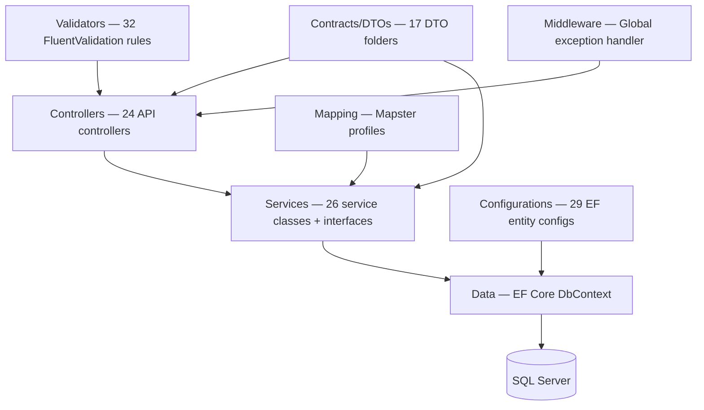
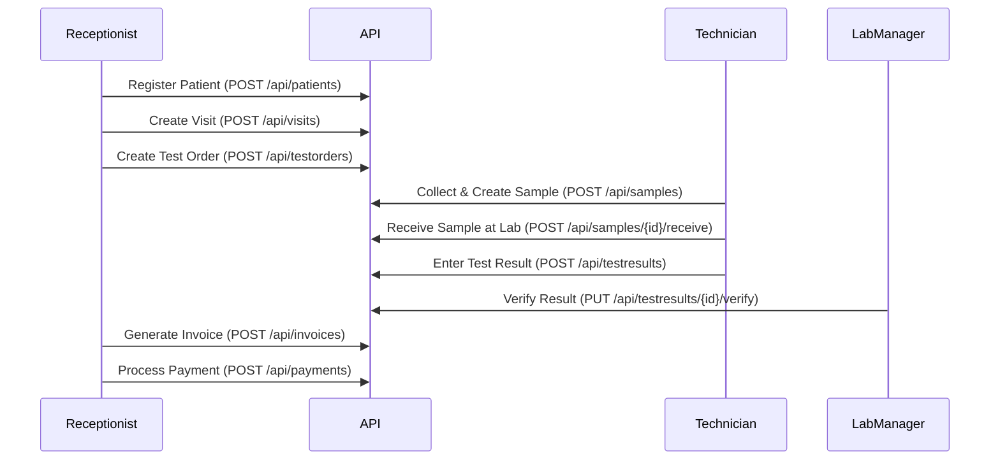
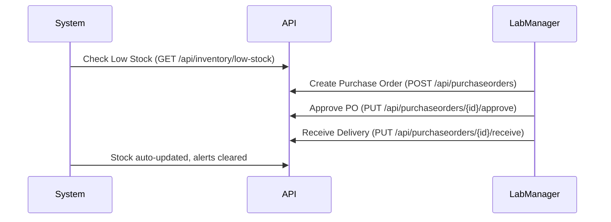
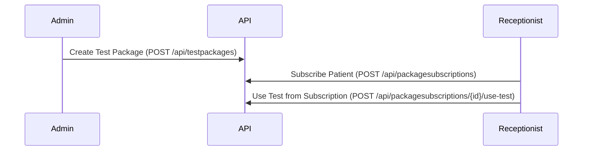
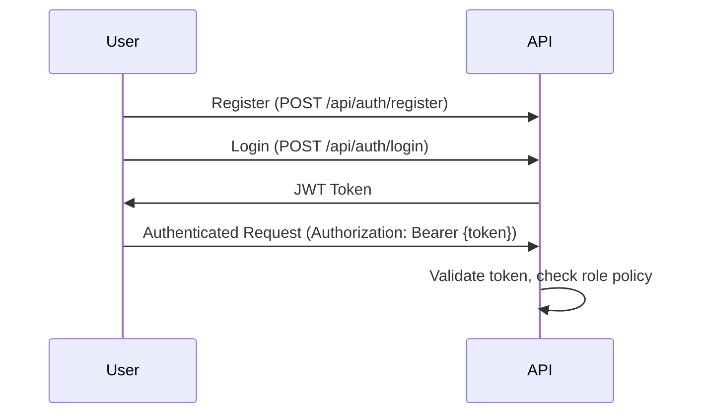

# LabMS — Project Analysis & Production Readiness

## 1. What Is This Project?

**LabMS** (Lab Management System) is a **backend REST API** built with **ASP.NET Core 8 / .NET 8** for managing the operations of a **medical/clinical laboratory**. It covers the full lifecycle from patient registration through sample collection, lab testing, result reporting, billing, and inventory management.

It is a **server-side API only** — there is no frontend UI. It exposes Swagger/OpenAPI documentation at `/swagger` in development mode.

---

## 2. Tech Stack

| Layer | Technology |
|---|---|
| **Framework** | ASP.NET Core 8 (Minimal hosting) |
| **Language** | C# / .NET 8 |
| **Database** | SQL Server (via EF Core 8) |
| **ORM** | Entity Framework Core 8 |
| **Authentication** | JWT Bearer tokens (BCrypt password hashing) |
| **Validation** | FluentValidation |
| **Object Mapping** | Mapster |
| **Logging** | Serilog (Console + File sinks, with enrichers) |
| **API Documentation** | Swashbuckle / Swagger |
| **Containerisation** | Docker (multi-stage Dockerfile, Linux target) |
| **Rate Limiting** | ASP.NET Core built-in rate limiter |

---

## 3. Architecture

The project follows a **layered architecture** (not Clean Architecture, but service-oriented):

**Key patterns used:**
- Service Layer pattern (business logic in services, not controllers)
- DTO pattern (Contracts folder for request/response objects)
- Dependency Injection (all services registered as scoped)
- Repository pattern (implicitly via DbContext)
- Global exception handling middleware

---

## 4. Domain Modules & Entities (29 entities)

### Core Clinical
| Module | Entities | Description |
|---|---|---|
| **Patients** | `Patient` | Patient demographics, registration |
| **Doctors** | `Doctor` | Referring doctors |
| **Visits** | `Visit` | Patient visits / encounters |
| **Lab Tests** | `LabTest` | Lab test catalog (name, price, category) |
| **Test Orders** | `TestOrder` | Ordered tests per visit |
| **Test Results** | `TestResult` | Result entry and verification |
| **Reports** | `Report` | Lab reports |

### Sample Management
| Module | Entities | Description |
|---|---|---|
| **Samples** | `Sample`, `SampleTracking` | Barcode-based sample lifecycle (Collected → InTransit → Received → InTesting → Tested → Disposed) |

### Billing & Financials
| Module | Entities | Description |
|---|---|---|
| **Invoices** | `Invoice` | Billing invoices |
| **Payments** | `Payment` | Payment processing |
| **Payment Plans** | `PaymentPlan`, `PaymentPlanInstallment` | Installment-based payments |
| **Insurance** | `InsuranceClaim` | Insurance claim submission & tracking |
| **Discounts** | `DiscountRule` | Automated discount rules |
| **Refunds** | `Refund` | Refund processing |
| **Tax** | `TaxConfiguration` | Tax configuration |

### Test Packages
| Module | Entities | Description |
|---|---|---|
| **Packages** | `TestPackage`, `TestPackageItem` | Bundle multiple tests at a discounted price |
| **Subscriptions** | `PackageSubscription` | Recurring test subscriptions |

### Inventory & Supply Chain
| Module | Entities | Description |
|---|---|---|
| **Inventory** | `InventoryItem`, `InventoryTransaction`, `InventoryAlert` | Reagents, consumables, equipment tracking with low-stock alerts |
| **Suppliers** | `Supplier` | Vendor management |
| **Purchase Orders** | `PurchaseOrder`, `PurchaseOrderItem` | Procurement workflow |

### Identity & Security
| Module | Entities | Description |
|---|---|---|
| **Users** | `User`, `UserRole` | User accounts |
| **Roles** | `Role` | Seeded roles: Admin, Receptionist, Technician, LabManager |
| **Auth** | — | JWT login/register with role-based authorization |

---

## 5. Key Workflows

### Workflow 1: Patient Visit → Test → Result

### Workflow 2: Inventory & Procurement

### Workflow 3: Test Package Subscription

### Workflow 4: Authentication & Authorization

---

## 6. Current Build Status

> [!TIP]
> **The project builds successfully** with 0 errors and 0 warnings as of this analysis.

---

## 7. Production Readiness Assessment

### ✅ What's Already in Place

| Area | Status | Notes |
|---|---|---|
| Core business logic | ✅ | 26 services covering all major domains |
| JWT Authentication | ✅ | Login/register with BCrypt password hashing |
| Role-Based Authorization | ✅ | 4 roles: Admin, Receptionist, Technician, LabManager |
| Input Validation | ✅ | 32 FluentValidation validator classes |
| Global Exception Handling | ✅ | Environment-aware (hides stack traces in prod) |
| Structured Logging | ✅ | Serilog with file + console sinks |
| Rate Limiting | ✅ | 3 policies: Auth (5/min), General (100/min), Strict (10/min) |
| CORS | ✅ | Configurable allowed origins |
| Health Checks | ✅ | `/health/ready` and `/health/live` endpoints |
| HTTPS Enforcement | ✅ | HSTS enabled in production |
| Docker Support | ✅ | Multi-stage Dockerfile |
| Database Migrations | ✅ | 7 migrations present |
| Production Config | ✅ | Separate `appsettings.Production.json` |
| API Documentation | ✅ | Swagger with JWT auth support |
| EF Configurations | ✅ | 29 entity type configurations |

---

### ❌ What's Missing / Needs Attention for Production

#### 🔴 Critical (Must Fix)

| # | Issue | Details |
|---|---|---|
| 1 | **JWT key mismatch** | `Program.cs` reads `JWT_SECRET_KEY` env var for token validation, but `AuthService.cs` reads `Jwt:Key` from config for token generation. These must use the same key source. |
| 2 | **Hardcoded connection string** | `appsettings.json` contains `Server=DESKTOP-KE30QF3` — a local machine name. Production config has placeholder values `YOUR_PRODUCTION_SERVER`. Must use environment variables or secrets. |
| 3 | **No real test coverage** | The `LabMS.Tests.New` project contains a single empty test (`Test1`). The `TESTING_GUIDE.md` describes a comprehensive test suite, but the actual tests referenced (`LabMS.Tests/`) do not appear in the project. There are **zero meaningful tests**. |
| 4 | **No database seeding for admin user** | Only roles are seeded. There's no initial admin user, making it impossible to use the API after fresh deployment without manual DB manipulation. |
| 5 | **Production CORS placeholder** | `appsettings.Production.json` has `https://your-production-domain.com` — needs real domain. |

#### 🟡 Important (Should Fix)

| # | Issue | Details |
|---|---|---|
| 6 | **No CI/CD pipeline** | No GitHub Actions, Azure DevOps, or any CI/CD configuration files. |
| 7 | **No database health check** | The SQL Server health check is commented out in `Program.cs` (line 117). Only a self-check is active. |
| 8 | **Swagger enabled only in Development** | Consider enabling a read-only version in staging, or providing separate API docs. |
| 9 | **No API versioning** | The API has a single `v1` Swagger doc but no URL-based or header-based versioning middleware. |
| 10 | **No refresh token mechanism** | JWT tokens expire in 2 hours with no refresh flow — users must re-authenticate. |
| 11 | **No pagination** | List endpoints (e.g., `GET /api/patients`) likely return all records without pagination, which will not scale. |
| 12 | **Missing services not registered** | Several services have interfaces and implementations (e.g., `IAnalyticsService`, `IDiscountService`, `IInsuranceClaimService`, `IPaymentPlanService`, `IRefundService`, `ITaxService`) but are **not registered in `Program.cs`** — calling those controllers will result in runtime DI exceptions. |
| 13 | **No data migration strategy** | No mention of blue/green deployments or zero-downtime migration approach. |
| 14 | **Log file path is relative** | `logs/labms-.txt` is relative — in production containers or IIS, the working directory may differ. |

#### 🟢 Nice to Have

| # | Issue | Details |
|---|---|---|
| 15 | **No caching** | No Redis or in-memory caching for frequently-read data (lab test catalog, roles, etc.). |
| 16 | **No audit logging** | `AuditService` exists but audit records aren't captured systematically (no middleware or EF interceptor). |
| 17 | **No email/notification system** | No notification when results are ready, alerts triggered, etc. |
| 18 | **No file storage** | No PDF report generation or file attachment handling. |
| 19 | **No OpenTelemetry / APM** | No distributed tracing or application performance monitoring. |
| 20 | **Backup/recovery procedures** | Not documented or automated. |
| 21 | **Quality Control module** | Listed as a future priority but not implemented. |

---

## 8. Summary Verdict

> [!WARNING]
> **The project is NOT production-ready.** It is a well-structured backend API with solid foundations, but it has critical gaps — particularly the JWT key mismatch (which would cause auth failures), zero test coverage, and several unregistered services that would cause runtime crashes.

### Effort estimate to reach production:

| Priority | Work | Effort |
|---|---|---|
| Fix critical issues (#1-5) | JWT fix, secrets management, admin seeding, CORS | ~1–2 days |
| Register missing services (#12) | DI registration for 6+ services | ~1 hour |
| Write meaningful tests | Unit + integration tests for core workflows | ~1–2 weeks |
| Add pagination to list endpoints (#11) | Across all controllers | ~2–3 days |
| Set up CI/CD (#6) | GitHub Actions or Azure DevOps pipeline | ~1 day |
| Enable DB health check, refresh tokens, etc. (#7,10) | Security & reliability hardening | ~2–3 days |

**Total estimated effort to production: ~3–4 weeks** (assuming one developer, including testing).
